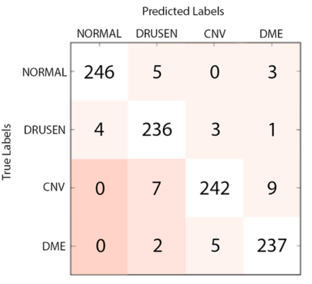
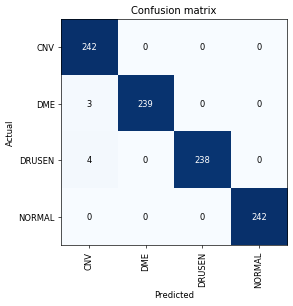
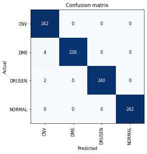

# Retina OCT images classification

Classifier for this [data](https://www.kaggle.com/paultimothymooney/kermany2018) from paper: ["Identifying Medical Diagnoses and Treatable Diseases by Image-Based Deep Learning"](https://www.cell.com/cell/fulltext/S0092-8674(18)30154-5) using fast.ai pipeline.

## Results from original paper

## Our results
ResNet50: F-beta score: 0.9928

DenseNet121: F-beta score: 0.9939

## Resume
* DenseNet121 (F-beta score 0.9934) performed slightly better than ResNet50 (F-beta score 0.9928)
* Original paper results were outperformed in 10 times smaller number of epochs
* Tricks like that were used:
    * transfer learning;
    * `fit_one\_cycle` learning policy;
    * splitting learning into stages;
    * discriminative learning rates during stage 2 etc

## License
[MIT](https://choosealicense.com/licenses/mit/)
